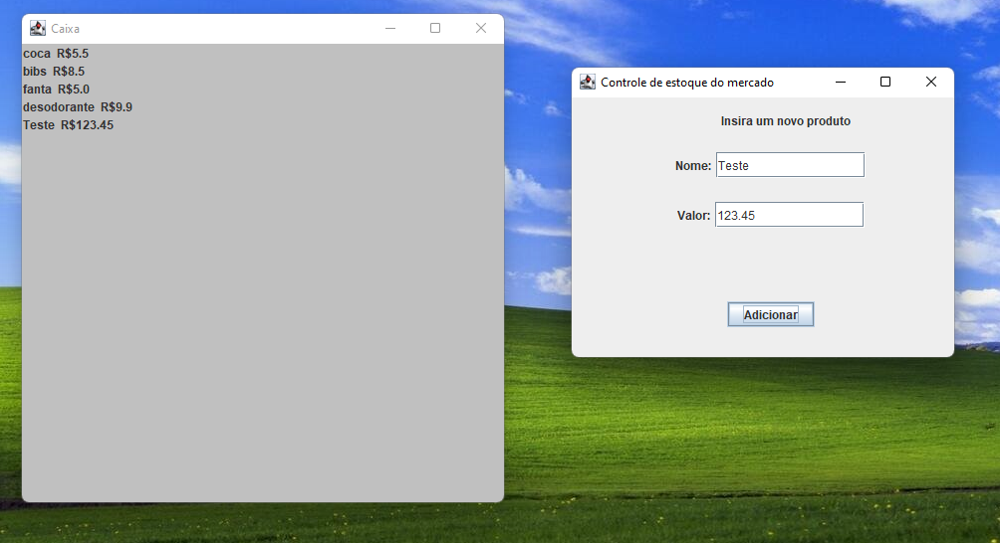
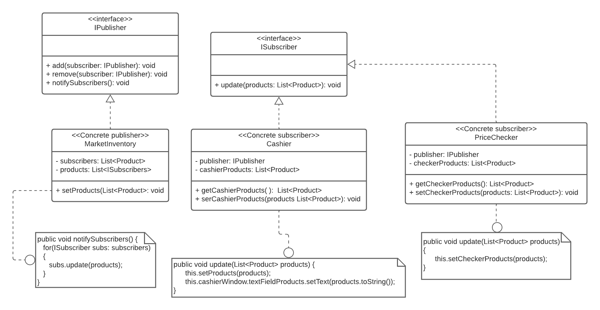

## Atividade pattern Observer - sistema de controle de estoque

Atividade desenvolvida na disciplina de design patterns

## Conteúdo

Aplicando o pattern Observer especificado no livro design patterns, o sistema desenvolvido simula e apresenta o valor dos produtos em estoque de um supermercado, atualizando os produtos e seus valores em todos consumidores (assim que um novo produto é adicionado, todos os caixas receberão o novo valor a cobrar pelos produtos).

- Desenvolvido em Java
- Interfaces feitas com Java swing

## Screnshot das interfaces:

## UML do código desenvolvido

